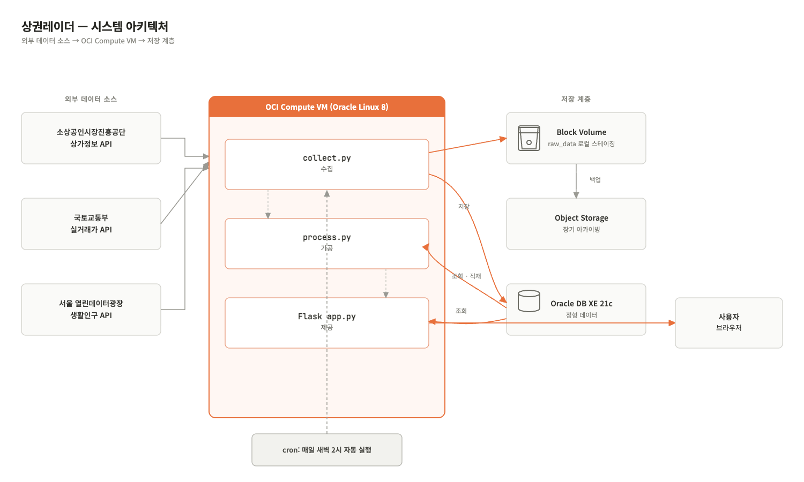
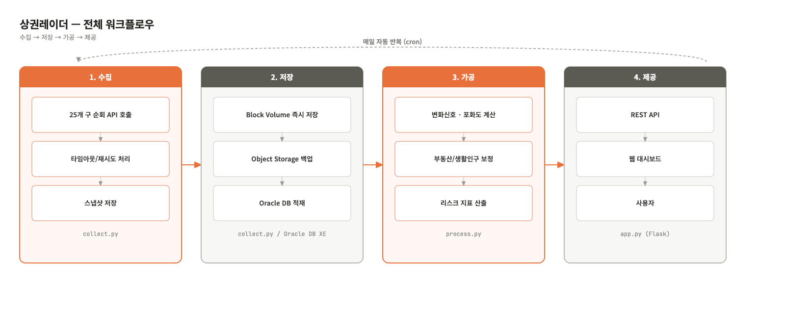

# 상권레이더 · 지역×업종 상권 비교 대시보드

**OCI 기반 Cloud 데이터 파이프라인** — 소상공인시장진흥공단 상권정보 × 국토교통부 실거래가 × 서울시 생활인구를 결합하여 지역·업종별 상권 지표를 비교하는 웹 대시보드 서비스

> **Live Demo**: `http://146.56.133.225:3000`  
> **Health Check**: `http://146.56.133.225:3000/api/health`  
> **API Example**: `http://146.56.133.225:3000/api/risk`  
> **Pipeline**: 수집 → 저장 → 가공 → 제공

---

## 목차

1. [서비스 소개 및 사용 시나리오](#1-서비스-소개-및-사용-시나리오)
2. [아키텍처 설명](#2-아키텍처-설명)
3. [평가 요구사항 대응표](#3-평가-요구사항-대응표)
4. [데이터 수집 범위](#4-데이터-수집-범위)
5. [설치 및 실행 방법](#5-설치-및-실행-방법)
6. [데이터 흐름 상세 설명](#6-데이터-흐름-상세-설명)
7. [API 엔드포인트](#7-api-엔드포인트)
8. [파일 구조](#8-파일-구조)
9. [한계점 및 향후 개선 방향](#9-한계점-및-향후-개선-방향)
10. [외부 오픈소스 출처](#10-외부-오픈소스-출처)

---

## 1. 서비스 소개 및 사용 시나리오

### 문제 정의

소상공인이 창업 지역을 결정할 때 참고할 정보인 상가 밀집도, 부동산 거래 흐름, 생활인구 데이터는 서로 다른 기관에 흩어져 있어 한눈에 비교하기 어렵다.  
상권레이더는 공공데이터 3종을 결합해 지역×업종 조합별 **상권 지표**를 산출하고, 필터·랭킹·비교·추세 기능으로 탐색을 돕는 웹 대시보드다.

### 분석 단위

상가정보 API는 서울 25개 자치구 단위로 호출하지만, API 응답에 포함된 행정동 정보를 기준으로 `region` 테이블을 구성한다.  
따라서 **수집 범위는 서울 25개 자치구**이고, 실제 분석 단위는 자동 발견된 **행정동×업종 조합**이다.

### 핵심 분석 지표

| 지표 | 정의 | 해석 |
|---|---|---|
| `change_score` | 직전 수집 대비 개업/폐업 변화 신호를 winsorize 후 0-100 정규화 | 최근 점포 변화 정도 |
| `saturation_score` | 해당 지역 전체 상가 중 해당 업종 비중을 winsorize 후 0-100 정규화 | 업종 밀집·경쟁 정도 |
| `realestate_adj` | 구 단위 이번달 상업업무용 부동산 실거래 건수 기반 보정값 | 부동산 시장 활력 반영 |
| `population_adj` | 구 단위 생활인구 기반 보정값 | 생활인구 규모 반영 |
| `risk` | `0.5×change_score + 0.5×saturation_score + realestate_adj + population_adj`를 0-100으로 클리핑 | 최종 종합 참고 지표 |

### 사용 시나리오

```text
[시나리오 1] 예비 창업자
한식음식점 창업을 고민 중인 사용자가 홈 화면 Top5와 랭킹 페이지를 통해
상대적으로 주의가 필요한 지역과 양호한 지역을 빠르게 확인한다.
이후 비교 페이지에서 두 후보 지역의 breakdown 지표를 나란히 비교한다.

[시나리오 2] 상권 분석가
특정 지역×업종 조합의 시계열 추세를 확인한다.
매일 새벽 cron으로 누적되는 risk_score_history를 기반으로 변화 흐름을 파악한다.

[시나리오 3] 창업 컨설턴트
전체 데이터 테이블에서 지역명과 업종명을 검색하고 정렬하여
고객 상담에 필요한 후보 지역 데이터를 추출한다.
```

---

## 2. 아키텍처 설명

### 시스템 아키텍처



### 전체 워크플로우



### 사용한 OCI 리소스

| 리소스 | 세부 사양 | 용도 |
|---|---|---|
| Compute VM | VM.Standard.E4.Flex, Oracle Linux 8, Seoul Region | 애플리케이션 서버, 수집/가공 스크립트 실행, Oracle XE 호스팅 |
| Block Volume | 50GB, ext4, `/mnt/blockvol` 마운트 | 수집 직후 원본 데이터의 빠른 로컬 스테이징 |
| Object Storage | 버킷 `sangkwon-radar-raw` | 원본 JSON/XML 장기 아카이빙 |
| Oracle Database XE 21c | VM에 네이티브 설치 | 정형 데이터, 통계 테이블, 지표 테이블 저장 |
| VCN / Security List | 22, 1521, 3000 포트 개방 | SSH, Oracle DB, Flask 웹 서비스 접근 제어 |

> 실습 환경에서는 22/1521/3000 포트를 개방했다.  
> 실제 운영 환경이라면 1521 포트는 외부에 직접 노출하지 않고, DB는 내부 통신으로 제한하는 구성이 더 적절하다.

---

## 3. 평가 요구사항 대응표

| 과제 요구사항 | 본 프로젝트 구현 |
|---|---|
| 수집 | 공공 API 3종 수집: 소상공인 상권정보, 국토교통부 실거래가, 서울시 생활인구 |
| 저장 | Block Volume 원본 스테이징, Object Storage 장기 백업, Oracle XE 정형 데이터 적재 |
| 가공 | `process.py`로 변화 신호, 포화도, 부동산 조정, 생활인구 조정을 결합한 지표 산출 |
| 제공 | Flask REST API와 웹 대시보드 제공 |
| 자동화 | cron + `run_pipeline.sh`로 매일 수집 → 가공 → 백업 자동 실행 |
| 문서화 | 아키텍처 다이어그램, 워크플로우, 설치/실행 방법, 데이터 흐름, 한계점 정리 |

---

## 4. 데이터 수집 범위

### 소상공인시장진흥공단 상가정보 API

- 제공기관: data.go.kr, B553077
- 수집 범위: 서울 25개 자치구 전체
- 호출 방식: `divId=signguCd` 기준 구 단위 페이지네이션
- 수집량 제한: 구당 최대 4페이지 × 500건 = 최대 2,000건
- 자동 발견된 행정동: 누적 427개
- 업종 분류: 6개 업종으로 매핑

| 업종 코드 | 업종명 |
|---|---|
| I1 | 한식음식점 |
| I2 | 커피전문점/카페 |
| G2 | 편의점 |
| F1 | 치킨/피자/분식 |
| S1 | 미용실/네일 |
| E1 | 학원/교습 |

최근 수집 결과 예시는 다음과 같다.

| 테이블 | 건수 | 설명 |
|---|---:|---|
| `store_stat` | 1,916건 | 최신 지역×업종 통계 스냅샷 |
| `store_stat_history` | 3,991건 | append-only 점포 통계 시계열 |
| `risk_score` | 1,916건 | 최신 지역×업종 종합 지표 |
| `risk_score_history` | 5,748건 | append-only 지표 시계열 |
| `collection_log` | 전량 기록 | 배치 실행 이력 및 자동화 증빙 |

### 국토교통부 상업업무용 부동산 실거래가 API

- 제공기관: data.go.kr, 1613000
- 수집 범위: 서울 25개 자치구
- 호출 방식: 구 단위 `LAWD_CD`와 기준월 `DEAL_YMD`로 조회
- 활용 방식: 구 단위 이번달 거래건수를 보조 지표로 사용

국토부 실거래가 데이터는 거래 신고 시점과 기준월에 따라 수집량이 적거나 0건일 수 있다. 본 프로젝트에서는 해당 데이터를 예측의 핵심 근거가 아니라, 구 단위 부동산 시장 흐름을 반영하는 보조 신호로만 사용한다.

### 서울 열린데이터광장 생활인구 API

- 데이터셋: `SPOP_DAILYSUM_JACHI`
- 수집 범위: 서울 자치구별 일별 생활인구
- 실행마다 100건 조회
- 활용 방식: 구 단위 생활인구 규모를 보조 지표로 사용

---

## 5. 설치 및 실행 방법

### 사전 요구사항

- OCI Compute VM
- Oracle Linux 8
- Oracle Database XE 21c
- Python 3.6.8
- Security List에 22/1521/3000 포트 개방
- data.go.kr API Key
- 서울 열린데이터광장 API Key
- OCI CLI 인증 설정

> Oracle Linux 8 기본 Python 버전이 3.6.8이므로 최신 라이브러리 사용이 어렵다.  
> 따라서 `requirements.txt`에는 Python 3.6과 호환되는 버전을 고정했다.

### Step 1. Oracle XE 설치

```bash
sudo dnf install -y libaio bc

wget https://yum.oracle.com/repo/OracleLinux/OL8/appstream/x86_64/getPackage/oracle-database-preinstall-21c-1.0-1.el8.x86_64.rpm
sudo dnf -y localinstall oracle-database-preinstall-21c-1.0-1.el8.x86_64.rpm

wget https://download.oracle.com/otn-pub/otn_software/db-express/oracle-database-xe-21c-1.0-1.ol8.x86_64.rpm
sudo dnf -y localinstall oracle-database-xe-21c-1.0-1.ol8.x86_64.rpm

sudo /etc/init.d/oracle-xe-21c configure
sudo systemctl enable oracle-xe-21c
sudo systemctl start oracle-xe-21c
```

한글 데이터 깨짐 방지를 위해 다음 환경변수를 설정한다.

```bash
export NLS_LANG=AMERICAN_AMERICA.AL32UTF8
```

> `NLS_LANG`을 설정하지 않아 한글 데이터가 깨져 저장되는 문제가 발생했고, 이후 환경변수 설정 후 재수집/재적재하여 해결했다.

### Step 2. 애플리케이션 계정 및 스키마 생성

```bash
sqlplus system/<SYSTEM_PASSWORD>@localhost:1521/XEPDB1
```

```sql
CREATE USER sangkwon IDENTIFIED BY "<APP_PASSWORD>";
GRANT CONNECT, RESOURCE, CREATE VIEW TO sangkwon;
ALTER USER sangkwon QUOTA UNLIMITED ON USERS;
EXIT;
```

```bash
sqlplus sangkwon/<APP_PASSWORD>@localhost:1521/XEPDB1 @sql/schema.sql
```

### Step 3. 패키지 설치 및 환경변수 설정

```bash
git clone <REPOSITORY_URL>
cd sangkwon-radar

bash setup.sh

cp .env.example .env
nano .env
```

`.env` 예시는 다음과 같다.

```env
DATA_GO_KR_KEY=<data.go.kr_API_KEY>
SEOUL_API_KEY=<서울열린데이터광장_API_KEY>

ORACLE_USER=sangkwon
ORACLE_PW=<APP_PASSWORD>
ORACLE_DSN=localhost:1521/XEPDB1
```

> Object Storage 버킷명(`sangkwon-radar-raw`)과 인증 정보는 `.env`가 아니라 `scripts/backup_to_object_storage.sh`와 `oci setup config`(`~/.oci/config`)에서 관리한다.

`.env`는 각 Python 스크립트에서 `python-dotenv`로 자동 로드하므로 별도 `source` 또는 `export`가 필요하지 않다.

### Step 4. Block Volume 마운트

본 과제 제출 환경에서는 Block Volume을 실제로 생성하고 VM에 attach하여 raw 데이터 스테이징 저장소로 사용했다.

```bash
# OCI 콘솔에서 Block Volume 생성 후 VM에 attach
lsblk

sudo mkfs.ext4 /dev/sdX
sudo mkdir -p /mnt/blockvol
sudo mount /dev/sdX /mnt/blockvol

sudo blkid /dev/sdX
```

재부팅 후에도 자동 마운트되도록 `/etc/fstab`에 등록한다.

```bash
echo "UUID=$(sudo blkid -s UUID -o value /dev/sdX) /mnt/blockvol ext4 defaults,nofail 0 2" | sudo tee -a /etc/fstab
```

프로젝트의 `raw_data` 디렉토리를 Block Volume으로 이전하고 심볼릭 링크를 연결한다.

```bash
mkdir -p /mnt/blockvol/raw_data
rm -rf raw_data
ln -s /mnt/blockvol/raw_data raw_data
```

### Step 5. Object Storage 버킷 생성 및 백업 설정

본 과제 제출 환경에서는 Object Storage 버킷 `sangkwon-radar-raw`를 생성하고, 수집 원본 파일을 장기 보관용으로 업로드했다.

```bash
oci setup config
```

```bash
oci os bucket create \
  --compartment-id <COMPARTMENT_OCID> \
  --name sangkwon-radar-raw
```

업로드 확인 예시는 다음과 같다.

```bash
oci os object list \
  --bucket-name sangkwon-radar-raw \
  --all
```

### Step 6. 실제 데이터 수집 및 가공 실행

```bash
# 실제 공공 API 수집
python3 scripts/collect.py

# 수집 데이터 가공
python3 scripts/process.py

# Flask 대시보드 실행
python3 app/app.py
```

브라우저에서 다음 주소로 접속한다.

```text
http://146.56.133.225:3000
```

API 연결 상태는 다음 명령으로 확인한다.

```bash
curl http://146.56.133.225:3000/api/health
curl http://146.56.133.225:3000/api/risk
```

API 키 없이 파이프라인 구조만 테스트하려면 다음 명령을 사용할 수 있다.

```bash
python3 scripts/collect.py --sample
```

단, 과제 제출 결과는 sample 모드가 아니라 실제 공공 API 수집 결과를 기준으로 한다.

### Step 7. cron 자동화 등록

```bash
chmod +x run_pipeline.sh
crontab -e
```

다음 내용을 등록한다.

```cron
0 2 * * * /home/opc/sangkwon-radar/run_pipeline.sh
```

자동화 등록 확인:

```bash
crontab -l
```

실행 로그 확인:

```bash
tail -n 100 logs/collect.log
tail -n 100 logs/process.log
tail -n 100 logs/backup.log
```

`run_pipeline.sh`는 수집 → 가공 → 백업을 순서대로 실행한다.  
초기에는 세 단계를 각각 고정 시각 cron으로 등록했으나, 수집 시간이 5분을 넘기면 가공이 이전 데이터를 처리하는 경쟁 상태가 발생했다. 이후 세 단계를 하나의 스크립트로 묶어 `&&` 기반으로 순서를 보장하도록 재설계했다.

---

## 6. 데이터 흐름 상세 설명

### 6.1 수집 Collect

| 소스 | 방식 | 원본 저장 위치 | 정형 적재 위치 |
|---|---|---|---|
| 소상공인 상권정보 | `divId=signguCd`로 구 단위 페이지네이션, 실패 시 재시도 | Block Volume `raw_data/` | Oracle `region`, `store_stat`, `store_stat_history` |
| 국토부 실거래가 | 구 단위 `LAWD_CD`와 기준월 `DEAL_YMD` 조회 | Block Volume `raw_data/` | Oracle 가공 보조 데이터 |
| 서울 생활인구 | 자치구별 일별 생활인구 조회 | Block Volume `raw_data/` | Oracle 가공 보조 데이터 |

개업/폐업 산출 방식은 다음과 같다.

초기 설계에서는 상가정보 API 응답의 `chgGb` 필드를 이용하려 했으나, 실제 응답에는 해당 필드가 존재하지 않았다.  
따라서 현재는 이번 수집 스냅샷과 직전 수집 스냅샷의 `bizesId` 집합을 비교하여 개업/폐업을 산출한다.

```text
이번 스냅샷에는 있고 직전 스냅샷에는 없음 → 신규 개업
직전 스냅샷에는 있고 이번 스냅샷에는 없음 → 폐업 또는 목록 이탈
```

첫 실행처럼 직전 스냅샷이 없는 경우에는 개업/폐업 수를 0으로 처리한다.  
이 방식은 cron이 누적될수록 변화 추세가 더 의미 있어지는 구조다.

예외 처리는 다음과 같이 구현했다.

- API 타임아웃: 60초
- 페이지 요청 실패 시 최대 2회 재시도
- 특정 구/페이지 실패 시 전체 파이프라인 중단 대신 해당 항목만 건너뜀
- 같은 기준월 데이터는 DELETE 후 INSERT하여 멱등성 확보
- 실행 결과는 `collection_log`에 기록

### 6.2 저장 Store

저장소는 역할별로 분리했다.

```text
Block Volume
- 수집 직후 원본 JSON/XML을 빠르게 저장하는 로컬 스테이징 영역
- 경로: /mnt/blockvol/raw_data
- 프로젝트 내부에서는 raw_data 심볼릭 링크로 접근

Object Storage
- 원본 JSON/XML의 장기 아카이빙 영역
- 버킷: sangkwon-radar-raw
- backup_to_object_storage.sh로 업로드
- .uploaded_to_object_storage 파일로 중복 업로드 방지

Oracle XE
- 정형 데이터 저장소
- 지역, 업종, 통계, 지표, 배치 로그를 테이블로 관리
```

Oracle DB 주요 테이블은 다음과 같다.

| 테이블 | 설명 |
|---|---|
| `region` | API 응답에서 자동 발견한 지역 차원 테이블 |
| `industry` | 6개 업종 차원 테이블 |
| `store_stat` | 최신 지역×업종 점포수, 개업수, 폐업수 |
| `store_stat_history` | append-only 지역×업종 점포 통계 시계열 |
| `risk_score` | 최신 지역×업종 종합 지표와 breakdown |
| `risk_score_history` | append-only 종합 지표 시계열 |
| `collection_log` | 배치 실행 로그 및 자동화 증빙 |

원본 파일 구조는 다음과 같다.

```text
raw_data/
├── sangkwon_real_*.json
├── realestate_*.xml
├── population_real_*.json
└── .uploaded_to_object_storage
```

### 6.3 가공 Process

`process.py`는 Oracle DB에 저장된 정형 데이터를 기반으로 최종 상권 지표를 산출한다.

1. **변화 신호 계산**

```text
raw_change = (close_cnt - open_cnt) / (store_cnt + 1)
```

`raw_change`를 5-95 백분위수로 winsorize한 뒤 0-100으로 정규화하여 `change_score`를 만든다.

2. **포화도 신호 계산**

```text
saturation = 해당 지역의 특정 업종 점포수 / 해당 지역의 전체 점포수
```

`saturation` 역시 5-95 백분위수로 winsorize한 뒤 0-100으로 정규화하여 `saturation_score`를 만든다.

3. **부동산 조정**

구 단위 이번달 상업업무용 부동산 실거래 건수를 기반으로 `realestate_adj`를 계산한다.  
거래건수가 적을수록 상권 활력이 낮다고 보고 리스크를 가산한다.

4. **생활인구 조정**

구 단위 생활인구를 기반으로 `population_adj`를 계산한다.  
생활인구가 적을수록 잠재 유동 수요가 낮다고 보고 리스크를 가산한다.

5. **최종 지표 계산**

```text
risk = 0.5 × change_score
     + 0.5 × saturation_score
     + realestate_adj
     + population_adj
```

최종 `risk` 값은 0-100 범위로 clipping한다.  
또한 `change_score`, `saturation_score`, `realestate_adj`, `population_adj`를 모두 별도 컬럼으로 저장하여 대시보드에서 구성 요소를 투명하게 확인할 수 있도록 했다.

표본 수가 너무 적은 조합은 신뢰도가 낮기 때문에 별도 경고 로그를 남기며, 화면의 Top5/랭킹에서는 점포수 5개 미만 조합을 제외한다.

### 6.4 제공 Serve

`app.py`는 Flask 기반 REST API와 정적 대시보드를 제공한다.

```text
Oracle XE
  ↓
Flask app.py
  ↓
REST API
  ↓
dashboard.html
  ↓
사용자 브라우저
```

대시보드는 다음 기능을 제공한다.

- 홈 요약
- 업종/지역 필터
- 양호/주의 Top5
- 지역×업종 랭킹
- 두 지역 비교
- 특정 지역×업종 시계열 추세
- 전체 데이터 테이블
- 정렬 및 검색

---

## 7. API 엔드포인트

| 메서드 | 경로 | 설명 |
|---|---|---|
| GET | `/` | 대시보드 웹 페이지 |
| GET | `/api/health` | 서버 및 DB 연결 상태 확인 |
| GET | `/api/risk` | 전체 지역×업종 지표 반환 |
| GET | `/api/trend/<region_cd>/<ind_cd>` | 특정 지역×업종 조합의 시계열 반환 |

### `/api/health` 응답 예시

```json
{
  "status": "ok",
  "db": "connected"
}
```

### `/api/risk` 응답 필드 예시

```json
[
  {
    "region_cd": "11680600",
    "region": "역삼1동",
    "gu": "강남구",
    "ind_cd": "I2",
    "industry": "커피전문점/카페",
    "ym": "202607",
    "store_cnt": 42,
    "open_cnt": 1,
    "close_cnt": 0,
    "risk": 37.8,
    "change_score": 22.1,
    "saturation_score": 45.5,
    "realestate_adj": -3.0,
    "population_adj": 4.2
  }
]
```

---

## 8. 파일 구조

```text
sangkwon-radar/
├── sql/
│   └── schema.sql
├── scripts/
│   ├── collect.py
│   ├── process.py
│   └── backup_to_object_storage.sh
├── app/
│   ├── app.py
│   └── static/
│       └── dashboard.html
├── docs/
│   ├── architecture.png
│   └── workflow.png
├── logs/
│   ├── collect.log
│   ├── process.log
│   └── backup.log
├── run_pipeline.sh
├── setup.sh
├── requirements.txt
├── .env.example
└── README.md
```

| 파일 | 설명 |
|---|---|
| `sql/schema.sql` | Oracle DB 테이블 생성 DDL |
| `scripts/collect.py` | 공공 API 3종 수집, 원본 저장, 통계 적재 |
| `scripts/process.py` | 상권 지표 산출 및 `risk_score` 적재 |
| `scripts/backup_to_object_storage.sh` | `raw_data` 원본 파일을 Object Storage에 백업 |
| `app/app.py` | Flask REST API 및 대시보드 서빙 |
| `app/static/dashboard.html` | 대시보드 UI |
| `run_pipeline.sh` | 수집 → 가공 → 백업 순서 보장 실행 스크립트 |
| `setup.sh` | 초기 패키지 설치 스크립트 |
| `requirements.txt` | Python 3.6.8 호환 패키지 버전 고정 |
| `.env.example` | 환경변수 템플릿 |

---

## 9. 한계점 및 향후 개선 방향

### 현재 한계점

| 항목 | 내용 |
|---|---|
| 예측 모델 아님 | 실제 폐업 이력으로 검증된 AI 모델이 아니다. 공공데이터 기반 탐색용 참고 지표다. |
| 가중치 임의 설정 | 변화 신호/포화도 50:50, 부동산/생활인구 ±15점은 통계적으로 학습된 값이 아니다. |
| 커버리지 캡 | 상가정보 API를 구당 최대 2,000건까지 수집하므로 대형 구는 전수 데이터가 아닐 수 있다. |
| 시계열 데이터 부족 | 프로젝트 기간상 cron으로 쌓인 데이터가 아직 짧다. 장기 누적될수록 추세 분석이 의미 있어진다. |
| 국토부 실거래가 보조 지표 한계 | 기준월과 신고 시점에 따라 거래건수가 적거나 0건일 수 있다. |
| 업종 분류 제한 | 현재는 6개 업종만 키워드 기반으로 분류한다. |
| Python 3.6 환경 제약 | Oracle Linux 8 기본 Python이 3.6.8이라 최신 라이브러리 대신 구버전을 사용했다. |

### 향후 개선 방향

1. 소상공인365, 나이스비즈맵 등 검증된 상권분석 데이터와 교차 검증
2. 서울 25개 구에서 전국 단위로 수집 범위 확장
3. 장기 시계열을 확보한 뒤 가중치를 데이터 기반으로 재조정
4. Object Storage Lifecycle Policy를 적용해 원본 데이터를 Standard → Archive로 자동 계층화
5. 업종 분류를 6종에서 더 세분화
6. 지도 기반 Choropleth 시각화 추가
7. 실제 폐업 이력 데이터 확보 시 예측 모델과 비교 실험 수행
8. 운영 환경에서는 DB 포트를 내부망으로 제한하고 보안 구성을 강화

---

## 10. 외부 오픈소스 출처

| 라이브러리 | 버전 | 용도 | 라이선스 |
|---|---|---|---|
| Flask | 2.0.3 | 웹 프레임워크 / REST API | BSD-3-Clause |
| python-oracledb | 1.4.2 | Oracle DB 연결, thin 모드 | Apache 2.0 |
| requests | 2.27.1 | HTTP API 호출 | Apache 2.0 |
| python-dotenv | 0.20.0 | `.env` 환경변수 로드 | BSD-3-Clause |
| Chart.js | CDN 최신 버전 | 웹 차트 시각화 | MIT |
| OCI CLI | 3.83.0 | Object Storage 관리 | UPL / Apache 2.0 |

Python 3.6.8 환경 제약으로 위 라이브러리는 해당 버전과 호환되는 버전으로 고정했다.  
대시보드 UI 초안은 Claude Design을 활용해 프로토타이핑했으며, 최종 HTML/CSS/JavaScript는 프로젝트 구조에 맞게 수정하여 Flask 정적 파일로 통합했다.
